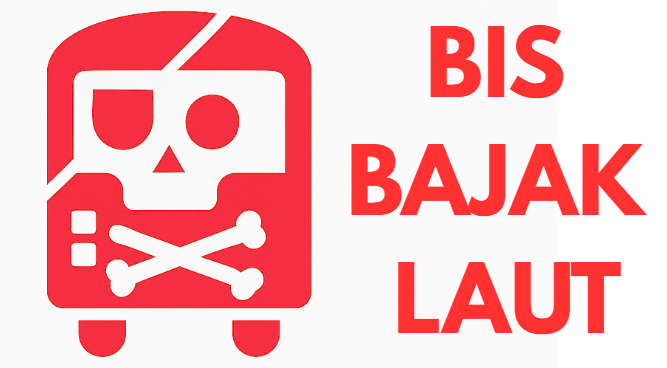

    
  

    
  
  
  
  
   
  <b>Bis Bajak Laut</b> is a Copy of <a href="https://docs.buspirate.com/">Bus Pirate</a>

 

# 🍿 Hardware

## 🌳 Log

- 10 Oktober 2025, 19:30, start date.

## 🧰 References

- [bus pirate hardware documentation](https://docs.buspirate.com/docs/overview/hardware/)
